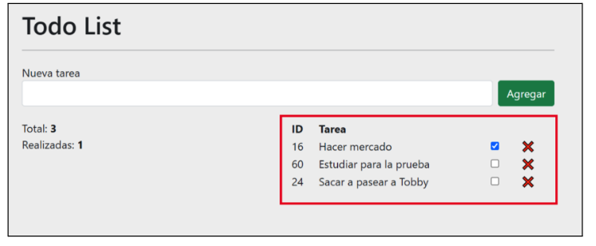

# Entregable Métodos de arreglos

Este es un entregable de la materia Métodos de arreglos, en el cual se implementa un To Do List en JavaScript. El objetivo es practicar el uso de métodos de arreglos y mejorar la comprensión de su funcionamiento.

## Descripción del proyecto
El proyecto consiste en una aplicación web que permite a los usuarios crear y eliminar tareas. Las tareas se almacenan en un arreglo y se muestran en la interfaz de usuario. Los usuarios pueden marcar las tareas como completadas o eliminarlas. 

